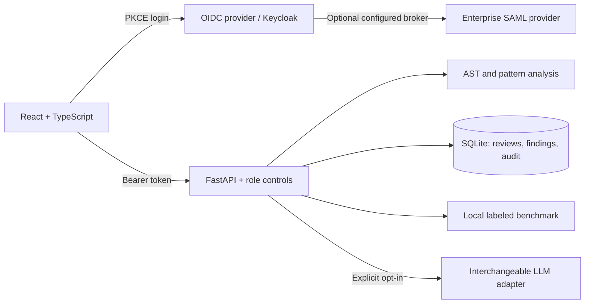

# Code Review AI — Alan Vo | AI & Machine Learning

Code Review AI helps developers triage risky source code and unified diffs. A deterministic Python AST and pattern engine produces line-level findings; optional LLM advice explains those findings. The React dashboard stores reviews, supports filtered history and JSON exports, and exposes a reproducible rule benchmark.

## Architecture



## Install and run locally

Python 3.12 and Node 24 are used in CI. From the repository root:

```sh
python3 -m venv .venv
.venv/bin/pip install -r backend/requirements.txt
DEMO_MODE=true HOST=127.0.0.1 PYTHONPATH=backend .venv/bin/uvicorn app.main:app --host 127.0.0.1 --port 8000
```

In a second terminal:

```sh
cd frontend
npm ci
npm run dev
```

Open http://127.0.0.1:3000. Demo access is local-only and has the operator role. Submit Python such as `eval(user_input)`, inspect the finding and suggested remediation, open review history, and export the result. Deleting reviews and running saved evaluations require an administrator. Demo mode is refused for production or a non-loopback configured host.

The original CLI remains in `main.py`; install the original `requirements.txt` for that interface and run `python main.py --help`. Its provider configuration is separate from the web server.

## SSO and containers

```sh
docker compose -f compose.yaml up --build
```

This starts the API, frontend, and a development Keycloak realm. Visit http://127.0.0.1:8080, sign into the administration console with the development credentials in `compose.yaml`, and create a realm user with a password and one of `viewer`, `operator`, or `admin`. The imported public client requires S256 PKCE and adds the API audience to access tokens. Return to the application and select **Sign in with SSO**.

The browser checks the signed ID token, issuer, audience, expiry, and nonce; the API independently checks the signed access token and roles. Access tokens stay in browser memory, so reloading requires another SSO sign-in. Local storage does not retain tokens. The API is bearer-only, and the frontend development server or nginx proxies `/api` to it.

SAML is supported through Keycloak's identity-provider broker, not a native SAML assertion endpoint in this application. The example broker is disabled until an operator supplies their actual IdP metadata and signing certificates. An external enterprise tenant has not been tested here. The bundled Keycloak `start-dev` service and example admin password are for local development only.

For deployment, use an HTTPS reverse proxy, a managed/configured OIDC provider, persistent backed-up SQLite storage, `ENV=production`, `DEMO_MODE=false`, and matching issuer/audience/JWKS settings. Build the frontend with your provider URL, realm, and client ID using the documented `VITE_KEYCLOAK_*` build arguments. Keep the API behind the frontend proxy. Restrict access to this shared review workspace: authorized viewers can see all reviews. Do not submit secrets in source code.

## Optional LLM configuration

No key is needed for static analysis or evaluation. Set `LLM_API_KEY` for external advisory calls. `LLM_PROVIDER`, `LLM_MODEL`, and `LLM_BASE_URL` are non-secret configuration fields:

| Provider setting | Endpoint configuration |
|---|---|
| `openai` or `openai-compatible` | A compatible `/v1` base URL and exposed model ID |
| `anthropic` | Messages API with the configured model |
| `gemini` | Generate-content API with the configured model |
| `ollama` | Local OpenAI-compatible `/v1` endpoint; no key required |

Advice is opt-in per submission. Enabling it sends the submitted code and detected findings to the configured service. Provider errors preserve the offline findings; they do not mark an unsuccessful request as an LLM result. LLM advice is untrusted text and does not execute code or change the deterministic finding set.

## API reference

Interactive schema: http://127.0.0.1:8000/docs in development. Send `Authorization: Bearer <access-token>` outside demo mode.

| Method / route | Purpose | Minimum role |
|---|---|---|
| `GET /api/health` | Health and demo status | Public |
| `POST /api/reviews` | Analyze and persist a source file or diff | Operator |
| `GET /api/reviews?limit=20&offset=0&language=python` | Paginated review history | Viewer |
| `GET /api/reviews/{id}` | Review and line-level findings | Viewer |
| `DELETE /api/reviews/{id}` | Delete review and findings | Admin |
| `GET /api/stats` | Review/finding counts | Viewer |
| `POST /api/evals` | Run and save local benchmark | Admin |
| `GET /api/evals` | Saved benchmark runs | Viewer |
| `GET /api/evals/{id}` | Benchmark evidence | Viewer |

Example JSON for `POST /api/reviews`:

```json
{"title":"Expression parser","language":"python","review_type":"full_file","focus_areas":"security","code_snippet":"eval(user_input)","use_llm_advisory":false}
```

For `review_type=diff`, provide `diff_text` and a nonempty `code_snippet` describing the source context. Supported languages are Python, JavaScript, TypeScript, Go, and Rust. Python receives AST checks; other languages use narrower pattern rules. Findings are indicators for review, not proof of exploitability. No inter-file dataflow or full language compiler is used.

## AI/ML evaluation

The reproducible offline baseline is the deterministic rule engine. Its versioned, hand-labeled synthetic cases live in `backend/app/services/data/evaluation.json`; pattern definitions live in `data/rules.json`. This fixture suite measures expected and unexpected rule detections, precision, recall, F1, and latency. It is not an independent production corpus or a measure of the optional LLM's accuracy.

```sh
PYTHONPATH=backend .venv/bin/python -c 'import json; from app.services.evaluator import run_evaluation; print(json.dumps(run_evaluation(), indent=2))'
PYTHONPATH=backend .venv/bin/python -m pytest backend/tests -q
cd frontend
npm test
npm run build
```

Failure cases include obfuscated calls, cross-file vulnerabilities, safe usages that match a risky pattern, and incomplete diff context. Review the per-case mismatches instead of interpreting a high fixture score as general security coverage. No model is trained or fine-tuned by this product.

## Operations

Back up the configured SQLite database while the app is stopped, or use SQLite's backup API. Reviews may contain proprietary code; define your own retention and access policy. Logs omit raw provider responses. GitHub CI runs backend tests, frontend tests/build, and both Docker builds on standard public-repository runners; it does not call paid LLMs or push images.

Maintained by **Alan Vo** · [GitHub](https://github.com/ALANDVO) · [alanvo@gmail.com](mailto:alanvo@gmail.com)
